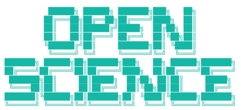
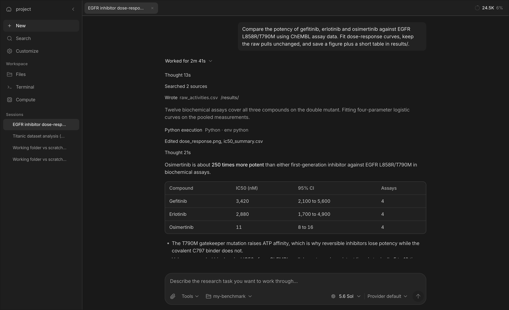

<div align="center">



<br/>
<br/>

**The open-source AI workbench for scientific research.**

Give it a goal. It reads the literature, writes and runs the code, runs the experiments, and writes up what it found, with every step on the record.

<br/>

[](https://github.com/synthetic-sciences/OpenScience/actions/workflows/ci.yml)
[](https://www.npmjs.com/package/@synsci/openscience)
[](https://github.com/synthetic-sciences/OpenScience/releases/latest)
[](LICENSE)

[Download](https://openscience.sh/download) · [Quickstart](https://openscience.sh/docs/#/openscience/quickstart) · [Documentation](https://openscience.sh/docs) · [Changelog](CHANGELOG.md) · [Contributing](CONTRIBUTING.md)

## 素盏（Suzhan）本地研究工作台

本仓库包含素盏的本地产品改造：TCM 文献证据闭环、三字段 OpenAI-compatible 模型连接、中英文界面切换，以及无需官网账户登录的本地工作模式。详细交付、Windows 启动和权重说明见 [SUZHAN.md](SUZHAN.md)。

素盏保留 OpenScience 的本地运行、连接器、凭据和科研工具能力；默认向量模型使用 Qwen3-Embedding-0.6B。大权重和完整便携运行包不进入普通 Git 历史，使用 Release asset、外部归档或 Git LFS 分发。

<br/>



</div>

<br/>

## What it is

OpenScience is a research agent with a workbench around it. You describe the task in plain language; it plans, gathers evidence, runs code and experiments, and hands back results you can check. It runs as a desktop app, a browser workspace, or a terminal command, on your machine, against your files.

It is built for the parts of research that are real work but not the idea: pulling and cleaning data, reproducing a claim, sweeping a parameter, drafting the methods section, checking a reference. You keep the idea and the judgment.

- **Every step is visible.** A turn reads as what happened: what it thought, what it searched, what it ran, what it wrote, then the answer. Nothing runs that you cannot see afterwards.
- **Real tools, real files.** Shell, Python and R kernels, notebooks, a file system with explicit read and write grants, remote compute when a laptop is not enough.
- **Scientific reach.** Hundreds of bundled skills across biology, chemistry, physics, ML and data engineering, plus connectors to databases such as ChEMBL, UniProt, PubMed and arXiv.
- **Delegation when it helps.** The lead agent can hand bounded work to workers, in parallel, and keeps the synthesis and the final say.
- **Your model, your terms.** Bring your own API keys, sign in to a supported provider, run a local model, or use Ace, the managed pay-as-you-go option.

## Install

**Desktop app.** [Download](https://openscience.sh/download) for macOS, Windows or Linux. It updates itself.

**Command line and browser workspace.**

```bash
npm install -g @synsci/openscience
openscience
```

Or run it without installing:

```bash
npx synsci
```

Or with the standalone installer on macOS and Linux:

```bash
curl -fsSL https://openscience.sh/install | bash
```

Then open **Customize → Models** and connect a provider, or from the terminal:

```bash
openscience keys add        # your own API key
openscience local add       # Ollama, LM Studio, or another local endpoint
```

The [installation guide](https://openscience.sh/docs/#/openscience/installation) covers platform details, updates and uninstalling.

## First task

Open a project folder and describe the work:

```bash
openscience ~/research/my-project
```

```text
Inspect data/samples.csv for missing values and inconsistent labels.
Keep the original data unchanged. Save a quality report and a plot
in results/, with the code needed to reproduce them.
```

Start with `/plan` when you want to agree on the method first. For a single turn from a script or a pipeline:

```bash
openscience run "Review the analysis plan in this project"
openscience run --continue "Suggest checks for the assumptions you identified"
```

Review sources, assumptions, code and outputs before relying on a scientific conclusion. The agent shows you what it did so that you can.

## What you can do

| Task                      | What happens                                                                                          |
| ------------------------- | ----------------------------------------------------------------------------------------------------- |
| **Review literature**     | Search scientific sources, compare findings, save cited evidence.                                     |
| **Analyze data**          | Inspect inputs, write and run analysis code, produce figures and reports.                             |
| **Reproduce experiments** | Agree on a claim, prerequisites and budget, then compare measured results.                            |
| **Run compute**           | Local kernels for everyday work; Modal for GPUs and long jobs, each dispatch approved before it runs. |
| **Reuse procedures**      | Browse the bundled skills or add a workflow specific to your lab.                                     |
| **Extend it**             | MCP servers, custom agents and commands, plugins, or the TypeScript SDK.                              |

A skill describes a procedure; it does not mean every tool or service it references is installed. Check availability in **Customize** before a substantial task.

### NVIDIA BioNeMo

OpenScience ships ten bring-your-own-key adapters for NVIDIA BioNeMo NIM endpoints: Boltz-2, DiffDock, Evo 2, GenMol, MolMIM, MSA Search, OpenFold2, OpenFold3, ProteinMPNN and RFdiffusion. Each has a strict request schema, one approval per dispatch, and hashed artifacts written into the session; they are marked experimental and need your own NVIDIA API key under NVIDIA's service terms. The `protein-binder-design` skill is adapted from the [NVIDIA BioNeMo Agent Toolkit](https://github.com/NVIDIA-BioNeMo/bionemo-agent-toolkit) (CC-BY-4.0 skills, Apache-2.0 code), pinned at commit `0e67a61`. See [Scientific tools](https://openscience.sh/docs/#/openscience/tool-catalog) and [Service credentials](https://openscience.sh/docs/#/openscience/service-credentials).

## How it works

```text
your request
  → Research agent plans, then works step by step
      → tools: shell, Python/R kernels, files, search, connectors, compute
      → workers for bounded parallel tasks (explore, execute)
  → answer, with the trace and the files it produced
```

- **Permissions.** Choose how much to ask: always, only for risky actions, or full access. Network commands ask once per destination host. Files outside the project are read or written only with an explicit grant.
- **Working folder.** A conversation works in the project's connected folder; caches and throwaway output stay in a per-session scratch space.
- **Publishing stays with you.** `git push`, releases and uploads run from the lead session with this machine's own GitHub and Hugging Face logins; no token is ever asked for in chat.

The [capability map](https://openscience.sh/docs/#/openscience/capabilities), [Explore tools](https://openscience.sh/docs/#/openscience/explore-tools) and the [skills directory](https://openscience.sh/docs/#/openscience/skill-library) list what is available and how to set it up.

## Model access

| Option            | Setup                                         | Cost                                        |
| ----------------- | --------------------------------------------- | ------------------------------------------- |
| **Your provider** | An API key or a supported sign-in.            | Your provider's billing.                    |
| **Local model**   | Ollama, LM Studio or any compatible endpoint. | Your hardware.                              |
| **Ace**           | Sign in, choose a workspace, fund its wallet. | Provider cost plus a 5.5% fee, per request. |

An account is optional for your own keys and local models. Details are in [Models](https://openscience.sh/docs/#/openscience/models), [Local models](https://openscience.sh/docs/#/openscience/local-models) and [Pricing](https://openscience.sh/docs/#/openscience/pricing).

## Documentation

| Topic        | Guides                                                                                                                                                                                                                                                                                            |
| ------------ | ------------------------------------------------------------------------------------------------------------------------------------------------------------------------------------------------------------------------------------------------------------------------------------------------- |
| First use    | [Quickstart](https://openscience.sh/docs/#/openscience/quickstart), [Workspace](https://openscience.sh/docs/#/openscience/workspace), [Workflow cookbook](https://openscience.sh/docs/#/openscience/workflow-examples)                                                                            |
| Research     | [Literature reviews](https://openscience.sh/docs/#/openscience/literature-review), [Data analysis](https://openscience.sh/docs/#/openscience/data-analysis), [Reproduction](https://openscience.sh/docs/#/openscience/reproduction), [Writing](https://openscience.sh/docs/#/openscience/writing) |
| Capabilities | [Skills](https://openscience.sh/docs/#/openscience/skill-library), [Databases](https://openscience.sh/docs/#/openscience/databases), [Connectors](https://openscience.sh/docs/#/openscience/connectors)                                                                                           |
| Control      | [Permissions](https://openscience.sh/docs/#/openscience/permissions), [Files](https://openscience.sh/docs/#/openscience/files), [Project instructions](https://openscience.sh/docs/#/openscience/instructions), [Configuration](https://openscience.sh/docs/#/openscience/configuration)          |
| Automate     | [CLI reference](https://openscience.sh/docs/#/openscience/commands), [JSON output](https://openscience.sh/docs/#/openscience/automation), [SDK and editors](https://openscience.sh/docs/#/openscience/extensions)                                                                                 |
| Help         | [Troubleshooting](https://openscience.sh/docs/#/openscience/troubleshooting), [FAQ](https://openscience.sh/docs/#/openscience/faq)                                                                                                                                                                |

The documentation is also available as plain text for agents: [llms.txt](https://openscience.sh/docs/llms.txt) and [llms-full.txt](https://openscience.sh/docs/llms-full.txt).

## Repository

```text
backend/cli          The openscience CLI and local server: sessions, tools, providers, skills
frontend/workspace   The browser workspace (SolidJS), embedded into the CLI at build time
frontend/ui          Shared components, themes and icons
frontend/desktop     The Electron shell and its signed self-updater
frontend/docs        The documentation site
tooling/sdk          The TypeScript SDK, generated from the server's OpenAPI contract
tooling/plugin       The plugin runtime
docs/notes           Engineering notes: verification, releases, how to add a skill, tool or connector
```

```bash
bun run setup        # verify Bun, install, embed the workspace UI
bun dev              # run from source
bun run check        # format, typecheck and every unit suite
```

[ARCHITECTURE.md](ARCHITECTURE.md) explains how the pieces fit. [CONTRIBUTING.md](CONTRIBUTING.md) has the development loops, the checks that gate a pull request, and how to add a skill, connector, tool or plugin. [AGENTS.md](AGENTS.md) holds the conventions the code follows.

## Releases

Stable releases are cut from `main` by the publish workflow after a full rehearsal at the same commit: packaged end-to-end tests, operating-system smokes and scientific capability canaries on every native platform. [GitHub Releases](https://github.com/synthetic-sciences/OpenScience/releases) carries the desktop installers, CLI archives and checksums; the [changelog](CHANGELOG.md) records what changed for users.

The desktop app updates itself. For the CLI, run `openscience upgrade`, or `npm install -g @synsci/openscience@latest` for an npm installation.

## Community and support

- Bugs and feature requests: [GitHub Issues](https://github.com/synthetic-sciences/OpenScience/issues). Use the templates; a good report has a reproduction.
- Security: [SECURITY.md](SECURITY.md). Please report vulnerabilities privately.
- Conduct: [CODE_OF_CONDUCT.md](CODE_OF_CONDUCT.md).
- Billing and account questions: use the account support channel rather than a public issue.

## Acknowledgements

OpenScience is inspired by [OpenCode](https://opencode.ai) by [Anomaly](https://github.com/anomalyco/opencode) and shares its commitment to excellent open-source agents. We want to bring strong, open-source scientific agents to everyone.

Most of the bundled skills come from open collections written by other people:

- [Scientific Agent Skills](https://github.com/K-Dense-AI/scientific-agent-skills) and [Claude Scientific Writer](https://github.com/K-Dense-AI/claude-scientific-writer) by **K-Dense Inc.** (MIT) — 180 of the biology, chemistry, database, research, writing and visualization skills. If they contribute to published work, cite Kassis, Agarwal, He, Patel and Brueckner, [_Scientific Agent Skills: A Library of Procedural Knowledge for Research Agents_](https://arxiv.org/abs/2609.00065) (2026).
- [AI Research Skills](https://github.com/Orchestra-Research/AI-Research-SKILLs) by **Orchestra Research** (MIT) — 79 of the ML training, inference, LLM-tooling and cloud-compute skills.
- [Hugging Face skills](https://github.com/huggingface/skills) by **Hugging Face** (Apache-2.0) — the `hugging-face-*` skills.
- [Anthropic's document skills](https://github.com/anthropics/skills) (docx, pdf, pptx, xlsx), under Anthropic's terms.
- [NVIDIA BioNeMo Agent Toolkit](https://github.com/NVIDIA-BioNeMo/bionemo-agent-toolkit) (CC-BY-4.0 / Apache-2.0) — the protein binder design workflow.
- [MarkItDown](https://github.com/microsoft/markitdown) by Microsoft (MIT), [Claude-Science-System-Prompts](https://github.com/Shoko-official/Claude-Science-System-Prompts) by Shoko-official (Apache-2.0), [pacsomatic](backend/cli/skills/biology/pacsomatic) by Beifang Niu (MIT), and [Iconoir](https://github.com/iconoir-icons/iconoir) icons (MIT).

[`backend/cli/skills/ATTRIBUTION.md`](backend/cli/skills/ATTRIBUTION.md) lists every derived skill with its upstream path and license, and each skill's frontmatter names its original author. [NOTICE](NOTICE) carries the license texts.

## License

Apache License 2.0. See [LICENSE](LICENSE) and [NOTICE](NOTICE).

OpenScience is an independent project. It is not affiliated with, endorsed by, or sponsored by any model provider. Provider and model names are used only to describe compatibility.
