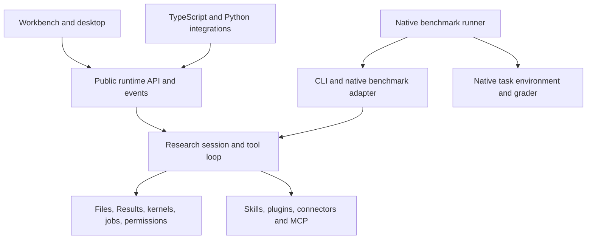

# OpenScience as a thin scientific runtime

Status: implementation direction and evaluation protocol, 7 September 2026.
The detachable runtime and the small refinements below exist in source. Winning
the five target benchmarks is an objective, not an observed result. A deterministic
Harbor fixture proves an execution contract; it measures no scientific ability.

The subsequent [OpenCode harness comparison](opencode-harness-comparison.md)
traces all active model-family prompts, provider adapters and both session loops.
Default Research has an explicit agent prompt, so the generic provider fallback
does not determine its header. The comparison separates this existing behavior
from provider API compatibility. The reproduced local-tool `stop` continuation
failure is corrected independently.

## The product boundary

OpenScience should provide one capable Research loop that a scientist can use in
the workbench and a developer can embed in a notebook, application, service, or
benchmark. The scientific advantage should come from useful capabilities and
reliable execution: finding appropriate methods, running analyses, managing
environments, retaining evidence, and producing usable outputs.

The core need not become a separate repository or a new graph framework to achieve
this. Keep one implementation and separate its public contract from its clients.
The current headless build removes embedded UI assets without forking the loop.

The server owns admission, session/run identity, decisions, cancellation, event
replay, and recovery. The loop owns model turns and tool use. Domain tools own
their execution contracts. Clients render and request work. Benchmark runners
own task inputs, environments, resource limits, grading, and aggregation. A client
must not recreate the agent loop or infer task success from a completed HTTP call.

The code paths are [the runtime](../../backend/cli/src/runtime),
[the session loop](../../backend/cli/src/session/prompt.ts),
[the TypeScript facade](../../tooling/sdk/js/src/v2/runtime.ts),
[the Python client](../../tooling/sdk/python), and
[the native Harbor adapter](../../tooling/harbor). HTTP integrations and the
versioned CLI event stream are two transports over the same session/tool runtime.
Campaign configs for these five benches live in
[`evals/science-harness`](../../evals/science-harness).

## What thin means

Minimize unnecessary decisions, serialized context, repeated setup, and compulsory
model calls. Preserve capabilities, execution ownership, and evidence. Source
line count alone is a poor measure: a reliable kernel or cancellable compute job
can require substantial implementation while adding no prompt overhead until used.

| Principle                                          | Consequence                                                                                                                                                                     |
| -------------------------------------------------- | ------------------------------------------------------------------------------------------------------------------------------------------------------------------------------- |
| One lead can finish an ordinary request naturally. | No mandatory planner/checker/critic sequence, contract file, artifact ceremony, or verifier gate for every answer.                                                              |
| Include context because this turn needs it.        | Short universal guidance; domain methods in on-demand skills; full logs behind references; measure tool-schema bytes and discovery misses.                                      |
| Capability and effort are separate choices.        | A cheaper configuration should retain scientific tools. Spend more on hard work through explicit budgets and selective help, rather than removing capabilities from normal use. |
| State is factual and owned outside the model.      | Existing session, job, tool, and artifact records are authoritative. A handoff summarizes them; it cannot create permission or certify execution.                               |
| Execution feedback should enable the next action.  | Distinguish invalid arguments, missing packages/data, denied access, tool failure, and a scientifically negative result. Preserve useful stderr and full output references.     |
| A component earns its place through measurement.   | Add one change, measure the outcome and overhead, and remove or narrow it if it fails the comparison.                                                                           |

Keep Python/R, files, shell, scientific connectors, warm kernels, immutable Results,
and recoverable compute jobs. Do not rewrite the existing model loop, lexical tool
selection, skill activation, compaction, or permission system just to resemble a
small coding agent. Those are separate hypotheses that need failure evidence.

## Small changes in this refinement

| Change                                                            | Reason and scope                                                                                                                                                                                                                               | Verification                                                                                                                                                                                                                                                                               |
| ----------------------------------------------------------------- | ---------------------------------------------------------------------------------------------------------------------------------------------------------------------------------------------------------------------------------------------- | ------------------------------------------------------------------------------------------------------------------------------------------------------------------------------------------------------------------------------------------------------------------------------------------ |
| Workspace guidance follows the authoritative filesystem snapshot. | `--workspace project` already executes in a durable shared project. The model was still told it was temporary scratch. Isolated sessions keep their existing behavior and permissions.                                                         | Environment tests cover both modes; CLI tests preserve project files and session workspace continuity.                                                                                                                                                                                     |
| Codex receives the exact Research header once.                    | It previously occupied both `instructions` and conversation context. Remove only that exact duplicate; retain distinct environment, skill, plugin, custom and user context. Other providers and distinct agent contracts retain their routing. | Prompt selection, local Responses serialization, context-preflight and manifest tests. The header at this revision is 1,937 UTF-8 bytes (`src/agent/prompt/researchagent-test.txt` plus `src/session/prompt/response.txt`); this is a byte saving, not a measured quality or billing gain. |
| Harbor disables UI title generation through existing config.      | `agent.title.disable: true` removes auxiliary label requests in headless trials. No new public flag or alternate loop. Interactive defaults, research, compaction and diff bookkeeping remain intact. Trusted runner overlays can override it. | The real local provider fixture preserves the research answer and diff summaries; default UI-title tests still run. Native Harbor conformance requires exactly two fixture requests: tool turn and final answer.                                                                           |
| ATIF declares the scope of accounting.                            | Recorded root-step usage is not a whole-trial invoice. Add scope metadata without changing existing totals or treating missing usage as zero.                                                                                                  | Real Harbor schema/validator and adapter tests; documented exclusions for unrecorded auxiliary requests and external tool/compute charges.                                                                                                                                                 |

These changes add no agent roles, dependencies, per-turn router calls, mandatory
verification phases, or benchmark-specific scientific instructions. The same
Research capability set remains available under the existing permission policy.

## Three separate questions to evaluate

### 1. Quality at a given cost and time

Measure the existing Research loop with a fixed model and declared inference
budgets before comparing changes. Preserve task splits, tool access, permissions,
and native grading. Do not use protected graders or answers to steer execution.

Plot native scientific quality against total dollars and elapsed time, separately
for each benchmark. A configuration is on the **measured frontier** only if another
tested configuration does not equal or exceed its quality with no greater cost
and time, with at least one strict improvement. Report uncertainty; small observed
differences do not prove dominance. Do not claim global Pareto optimality from a
finite configuration sweep.

The present Harbor `--auto-approve` path disables built-in delegation. Its tested
lane is a single lead with tools, even when `effort=ultra` is passed. Interactive
Normal/Ultra delegation remains available; do not weaken runtime permissions to
make a benchmark run.

### 2. Best scientific performance

Use mini-SWE-agent as a meaningful simple-loop baseline, conditional on a matched
model, budget, tools, and environment. Its
[official design](https://mini-swe-agent.com/latest/) emphasizes a small linear
agent with shell execution. That is a useful experimental control; it does not
establish that shell-only execution is best for science.

Begin with failures that added infrastructure can address: wrong environment,
unavailable method, bad tool discovery, lost state, unread output, broken recovery,
or an unvalidated numerical result. Improve the relevant tool, skill, or feedback
boundary before adding mandatory orchestration. Preserve negative findings and
uncertainty; more confident prose is not a performance improvement.

Compare separately: a matched-model harness panel; complete products with their
supported models and tools; and each benchmark's reference scaffold. Pin actual
coding and scientific agent implementations. Using the Biomni tool library does
not make a run the Biomni agent. Historical leaderboard rows belong in a labeled
historical panel unless task, grader, environment and run settings match.

### 3. Useful end-to-end scientific work

Add a distinct workflow panel after native benchmark conformance. Examples include
reusing an analysis across a new cohort, producing a reproducible report from
source data, continuing a long compute job after reconnecting, and using a plugin
to fetch data before a local analysis. Measure working outputs, provenance where
required, recovery, time and cost.

Keep equal-tool comparisons separate from complete-product comparisons. A native
benchmark may forbid a hosted search service or remote GPU even though those are
valuable product capabilities. Enforce that constraint in its adapter; retain
the capability for authorized real work.

## Five benchmark contracts

The following inventory was checked against the benchmark control plane at
`e5ccddbf43350e1b7d76ed7209a4f910e340b84c`. Task definitions and runner code,
rather than prose defaults, determine the run. No task instructions, hidden
answers, or rubric contents were used to tune this refinement.

| Requested benchmark      | Concrete lane                                                                                                 | Native contract                                                                                                                                                                                               | Remaining readiness work                                                                                                                                                                                                                      |
| ------------------------ | ------------------------------------------------------------------------------------------------------------- | ------------------------------------------------------------------------------------------------------------------------------------------------------------------------------------------------------------- | --------------------------------------------------------------------------------------------------------------------------------------------------------------------------------------------------------------------------------------------- |
| Terminal Bench Science   | v0.1.0, 70 tasks; Harbor dataset `terminal-bench-science/terminal-bench-science@v0.1`                         | Harbor 0.22.0; task configs give 8-hour agent limits, task-specific CPU/RAM/storage and separate verifiers. Native binary reward.                                                                             | Run through `evals/science-harness` with a SHA-pinned Linux candidate. Preserve native image and task policies.                                                                                                                               |
| Terminal-Bench 4 science | `terminal-bench/terminal-bench@4.0.0` science-domain slice; freeze IDs into `tb4-science-tasks.json`          | Harbor 0.22.0; native task limits and rewards. Distinct from Terminal-Bench-Science and from historical TB3 Science 15.                                                                                       | Freeze the science-domain task IDs from the 4.0.0 checkout before a scored run. Do not merge cohorts.                                                                                                                                         |
| BiomniBench              | Assumed **BiomniBench-DA public 50**, HF revision `e1c8ca5e11a620087bc48d97888eb69176a1f235`                  | Local manifest records Harbor 0.22.0, `/app/answer.txt`, `/app/trace.md`, rubric judging. Exact downloaded task envelopes were not verified because data is unstaged.                                         | Confirm intended split and authorized access; stage a selected sample, verify envelopes/collection, and separate judge credentials from agent-provider aliases. Public 50 is not the full/private 100.                                        |
| BixBench 3               | v1.0.0, 20 tasks; source `d0e0bbb41222335b1b8878f533a58466a3a782dc`                                           | **Inspect AI**, GCP, reference ReAct with persistent bash/Python and mediated web requests, 24-hour/5,000-message cap, host-side artifact grading.                                                            | Use `evals/science-harness/adapters/bixbench3.py` as the Inspect solver inside the native agent container; reuse VM/data/proxy/collection/grading. Label the whole-system variant.                                                            |
| ResearchClawBench        | 40 expert tasks; `InternScience/ResearchClawBench`                                                            | Host workspace, hidden target paper, rubric judge. Agent cmd in `evaluation/agents.json`; `<PROMPT>` is substituted with the prompt **text**, and the runner reads the model from the first JSON stdout line. | Point their `agents.json` at `evals/science-harness/adapters/researchclaw.py`. Keep judge credentials off the agent environment. Label the entry `OpenScience (Synthetic Sciences)`; their board already carries an unrelated "Open Science". |
| DrugDiscoveryBench       | 82 Harbor tasks; `scaleapi/DrugDiscoveryBench`, image `ghcr.io/scaleapi/drugdiscoverybench:1.0.0-lightweight` | Harbor task.toml schema 1.1 (upstream pins Harbor 0.13.1); 2-hour agent limit; OpenAI-compatible rubric judge via `[verifier.env]` `JUDGE_*`; rubrics come from a gated HF dataset.                           | Populate rubrics after gated access, pull the 23 GB image, run through the same adapter with `--dataset-path`; record the Harbor version difference in the identity.                                                                          |

The four Harbor 0.22 lanes select `openscience_harbor.agent:OpenScienceAgent`
through `evals/science-harness`. Do not duplicate the Research loop or silently
upgrade a native runner. Every public leaderboard in this set reports the mean
of three attempts per task at the harness's maximum reasoning effort; the
campaign layer defaults to three attempts and records effort and variant in the
frozen identity.

Bix launches the candidate in the existing agent container at `/workspace/work`,
preserving native network and grading boundaries. That is a labeled whole-system
comparison. Routing every tool through Inspect is additional work only for exact
reference-tool comparisons; it is not required to reuse native tasks and graders.
Do not launch the agent on the grading host.

For Bix, retain native continuous artifact scores and distinguish any paper-style
threshold normalization. Inspect's nonempty-output collection check is not
scientific correctness. ResearchClawBench's hidden-paper rubric is a different
scale from Biomni's 0–100 judge. Do not average these unlike metrics into a
synthetic “science score.” Keep exact scheduled task IDs, repeats and artifact
inventories, not only matching counts.

Primary upstreams: [Terminal Bench Science run contract](https://www.terminal-bench-science.ai/run),
[Terminal-Bench](https://www.tbench.ai/),
[BiomniBench-DA](https://huggingface.co/datasets/phylobio/BiomniBench-DA),
[BixBench3](https://github.com/EdisonScientific/BixBench3),
[ResearchClawBench](https://github.com/InternScience/ResearchClawBench), and
[DrugDiscoveryBench](https://github.com/scaleapi/DrugDiscoveryBench).
Biomni details above are explicitly the local locked manifest's recorded contract,
pending validation against authorized staged tasks.

## Evaluation sequence and promotion rules

1. **Freeze identities.** Record task-ID set, source/data/image digests, native
   runner, agent binary SHA, adapter revision, model snapshot, reasoning settings,
   tools, credentials by purpose, native limits, repeat inventory and retry rules.
   Resolve TB4 science-subset IDs and Biomni split before presenting a comparison.
2. **Complete zero-model-cost compatibility.** Package/factory tests, a compiled
   fixture, working directory, tool execution, cancellation, output collection,
   credential separation, event completion and native schema validation. Bix and
   ResearchClawBench each need their own native-runner tests; the Harbor fixture
   covers neither.
3. **Run a budgeted development panel.** Select tasks using public metadata before
   reading results. First compare frozen `fededb33` with the workspace fix; then
   title-call removal and Codex-only exact de-duplication. Keep each condition's
   actual serialized prompt/config. A simpler combined correctness candidate is
   acceptable if no per-change causal performance claim is made.
4. **Make measured refinements.** Reuse `SessionHarness` fingerprints and context
   telemetry. Candidate ablations include deferred plugin schemas, better retained
   failure output, compact recovery packets and selective stronger-model help.
   Keep capability access constant and measure discovery failures as well as saved
   tokens. Do not tune multiple changes and attribute a gain to the whole recipe.
5. **Freeze before held-out evaluation.** Development tasks are disclosed as such.
   Use a disjoint panel or a frozen full-suite protocol with the exposure clearly
   stated. Select campaign size and concurrency from observed costs and quotas.
   Do not silently retry failures or choose favorable seeds.
6. **Promote on evidence.** Require quality and reliability to meet a declared
   non-regression bound; require any efficiency claim to use complete cost/time
   accounting. Preserve the baseline and configuration switch for rollback.

For every scheduled attempt retain native result files, raw trajectories, errors,
artifacts and identity records. Reconcile model calls, retries, child agents,
search/web adjudication, rubric/process judges and external compute charges.
Report agent and evaluation overhead separately, plus the total. Distinguish
catalog estimates from measured charges and unknown values from zero.

Measure setup/staging, queue, agent execution, tool wait, judging, collection and
teardown separately. Distinguish cold/warm runs, reserved vCPU/RAM hours from
measured utilization, and success-only latency from all-attempt timeout behavior.
Use paired task/repeat assignments and interleaved order; estimate uncertainty by
resampling tasks rather than treating repeats of the same task as independent.
Any shorter cost/time-cap study is a labeled protocol beside the native-limit
comparison. Preserve evaluator failures with a preregistered rerun/exclusion rule.

## Existing extension contracts

Skills supply methods; tools expose typed operations; scientific connectors
describe integrations; MCP provides a process-separated tool protocol; plugins
add trusted host-side contributions. External applications consume the runtime
API. These contracts share existing session admission, cancellation, usage,
permissions, and storage rather than recreating them in each integration.

Installed plugin tools use the ordinary discovery path, with permissions enforced
at execution. Trusted in-process plugin code is not sandboxed by a tool permission
setting. The [plugin guide](writing-a-plugin.md) describes installation and rich
results; test-only fixtures exercise discovery, invocation, cancellation, removal,
and the applicable trust boundary. Use existing run/tool/artifact IDs to associate
output with work.

## What the harness-engineering reference contributes

The cloned reference is
[`walkinglabs/learn-harness-engineering` at `77e7a3e`](https://github.com/walkinglabs/learn-harness-engineering/tree/77e7a3e21469dcbece2558086c8d91657abeaa40).
Its useful ideas are progressive disclosure, factual handoffs, actionable
feedback, observability and removing unnecessary components. These are design
hypotheses to test in OpenScience.

Its [instruction simulation](https://github.com/walkinglabs/learn-harness-engineering/blob/77e7a3e21469dcbece2558086c8d91657abeaa40/docs/en/lectures/lecture-04-why-one-giant-instruction-file-fails/code/split-vs-monolithic.ts)
counts string-search lines, and its
[benchmark illustration](https://github.com/walkinglabs/learn-harness-engineering/blob/77e7a3e21469dcbece2558086c8d91657abeaa40/docs/en/lectures/lecture-12-why-every-session-must-leave-a-clean-state/code/benchmark-runner.ts)
contains fixed pass/duration values. Its
[graph example](https://github.com/walkinglabs/learn-harness-engineering/blob/77e7a3e21469dcbece2558086c8d91657abeaa40/docs/en/lectures/lecture-14-graph-engineering/code/maker_checker_graph.py)
has stubbed model calls, substring approval checks and an in-memory checkpoint
store. These are teaching material, not empirical gains or production controllers
to copy. Keep the useful principles; establish OpenScience's results with native
scientific tasks and measured end-to-end execution.
